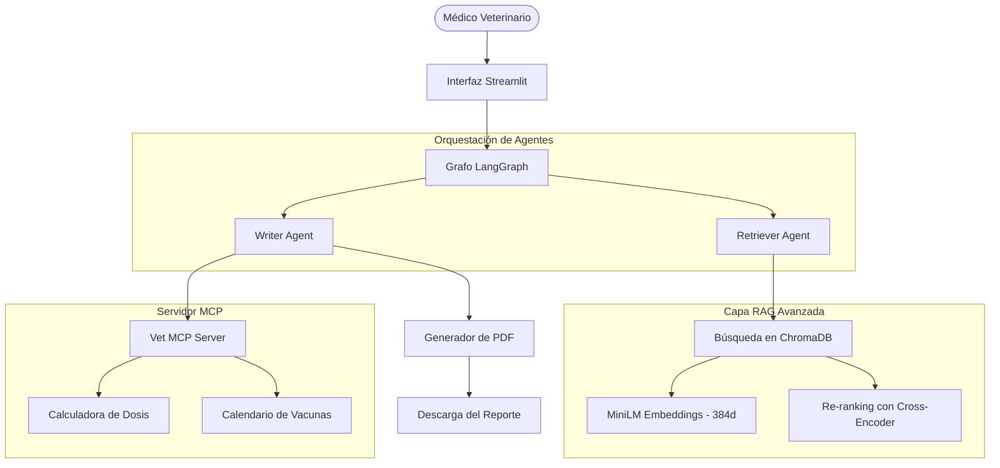

# 🐾 VetAssist AI — Copiloto Clínico Veterinario Inteligente

VetAssist AI es una plataforma de asistencia clínica inteligente diseñada para clínicas y centros de salud de pequeños animales (perros y gatos). El sistema permite al personal médico veterinario realizar consultas en lenguaje natural sobre diagnósticos, tratamientos, vacunas, dosificaciones y protocolos clínicos, devolviendo respuestas fundamentadas en un corpus de conocimiento local, citando fuentes científicas/formales y generando reportes clínicos en PDF de alta calidad.

El proyecto está diseñado bajo una arquitectura de vanguardia en Procesamiento de Lenguaje Natural (NLP), combinando sistemas de recuperación avanzada, orquestación de agentes con grafos y herramientas clínicas integradas bajo el estándar de comunicación abierta MCP (Model Context Protocol).

---

## 🌟 Características Principales

* **Búsqueda Clínica RAG de Alta Precisión**: Sistema de Generación Aumentada por Recuperación (RAG) que combina búsqueda semántica en base de datos vectorial local con una etapa secundaria de **Re-ranking semántico con Cross-Encoder** para filtrar ruido y asegurar la máxima relevancia del contexto médico.
* **Orquestación Multi-Agente con LangGraph**: Flujo de decisión estructurado mediante un grafo de agentes (Agente Buscador y Agente Redactor) que operan en un bucle con validación cruzada y políticas estrictas para prevenir alucinaciones clínicas.
* **Herramientas de Dosificación y Vacunación (Protocolo MCP)**: Exposición y ejecución estandarizada de herramientas de cálculo de dosis y esquemas de vacunación a través de un servidor MCP (Model Context Protocol).
* **Generación de Reportes PDF Sanitizados**: Exportación inmediata de las consultas en reportes clínicos profesionales listos para entregar a los propietarios del paciente, incluyendo citas de las fuentes consultadas y sanitización de texto.
* **Panel de Control RAG Interactivo**: Interfaz integrada en Streamlit que permite visualizar en tiempo real el estado de la base de conocimientos vectorial (ChromaDB) y re-indexar los documentos con un solo clic.

---

## 🏗️ Arquitectura Técnica y Flujo de Información

El sistema procesa y responde a las solicitudes médicas siguiendo este flujo:



1. **Ingesta y Segmentación**: Los documentos clínicos de la carpeta `data/raw/` se procesan de forma semántica con un fragmentador adaptativo (`Chunker`) y se transforman en vectores de 384 dimensiones mediante el modelo local `paraphrase-multilingual-MiniLM-L12-v2`.
2. **Recuperación Vectorial**: Al consultar al asistente, ChromaDB busca los fragmentos más relevantes y los entrega al **Re-ranker (Cross-Encoder)** (`ms-marco-MiniLM-L-6-v2`), el cual recalcula el peso semántico del par (Pregunta, Fragmento) y selecciona los 3 mejores fragmentos de información.
3. **Loop de Agentes**:
   * El **Agente Buscador** recoge los fragmentos más útiles del RAG.
   * El **Agente Redactor** consulta las herramientas del servidor MCP si es necesario (ej. dosis de medicamentos) y redacta la respuesta final usando el LLM de alto desempeño `Llama 3.3 70B` en Groq, verificando que no existan alucinaciones.
4. **Habilidad de Reportes (PDF)**: El usuario puede exportar los resultados a un reporte formal con un diseño limpio y profesional.

---

## 📂 Estructura del Código Fuente

* **`src/app.py`**: Interfaz de usuario web construida en Streamlit.
* **`src/config.py`**: Configuración centralizada de variables, constantes y modelos.
* **`src/ingestion/`**: Lógica de carga recursiva de archivos raw (`loader.py`), particionado inteligente (`chunker.py`) y generación de vectores (`embedder.py`).
* **`src/retrieval/`**: Controlador de ChromaDB (`vector_store.py`), modelo de Re-ranking (`reranker.py`) y pipeline RAG unificado (`rag_pipeline.py`).
* **`src/agents/`**: Definición del flujo multi-agente en LangGraph (`graph.py`, `state.py`, `retriever_agent.py`, `writer_agent.py`).
* **`src/mcp/`**: Servidor MCP local con herramientas clínicas de cálculo y consulta (`vet_mcp_server.py`).
* **`src/skills/`**: Habilidad de generación de reportes en PDF (`report_skill.py`).
* **`data/raw/`**: Base de conocimientos con 16 documentos y manuales clínicos en formato de texto.
* **`docs/`**: Documentación técnica detallada de decisiones técnicas, agentes, RAG y arquitectura general.

---

## 🛠️ Instalación y Configuración

### Requisitos de Entorno
* **Python 3.10 o superior** (Se recomienda Python 3.12).
* **Conexión activa a Internet** (para llamadas a la API de Groq y descargas iniciales de modelos).

### Paso 1: Clonar y Configurar Entorno Virtual
Abre la terminal en la raíz del proyecto y ejecuta:
```bash
# Crear el entorno virtual
python -m venv .venv

# Activar el entorno virtual (PowerShell)
.venv\Scripts\Activate.ps1

# Activar el entorno virtual (Linux/macOS)
source .venv/bin/activate
```

### Paso 2: Instalar Dependencias
Instala los paquetes necesarios indicados en `requirements.txt`:
```bash
pip install -r requirements.txt
```

### Paso 3: Configurar Variables de Entorno
1. Renombra el archivo `.env.example` a `.env`:
   ```bash
   cp .env.example .env
   ```
2. Abre el archivo `.env` e introduce tu clave API de Groq:
   ```env
   GROQ_API_KEY=tu_clave_de_groq_aqui
   ```

---

## 🚀 Uso de la Aplicación

### Ejecutar la Aplicación Web (Streamlit)
Levanta la interfaz gráfica del copiloto corriendo en tu terminal:
```bash
streamlit run src/app.py
```
La aplicación se abrirá automáticamente en tu navegador web en `http://localhost:8501`. 

*Nota: La primera vez que inicies el chat, ve a la sección **"📊 Estado del Sistema RAG"** en las pestañas principales y haz clic en **"🔄 Re-indexar Documentos"** para estructurar la base de datos vectorial local.*

### Inspeccionar y Ejecutar el Servidor MCP
Puedes ejecutar o depurar el servidor Model Context Protocol del proyecto utilizando el inspector oficial de Anthropic:
```bash
npx -y @modelcontextprotocol/inspector python src/mcp/vet_mcp_server.py
```

---

## 🧪 Pruebas Unitarias y Validación

El proyecto incluye un conjunto de pruebas unitarias automatizadas con `pytest` para verificar el correcto funcionamiento del pipeline RAG, el chunker y los agentes. Para ejecutarlas:
```bash
pytest tests/ -v
```
