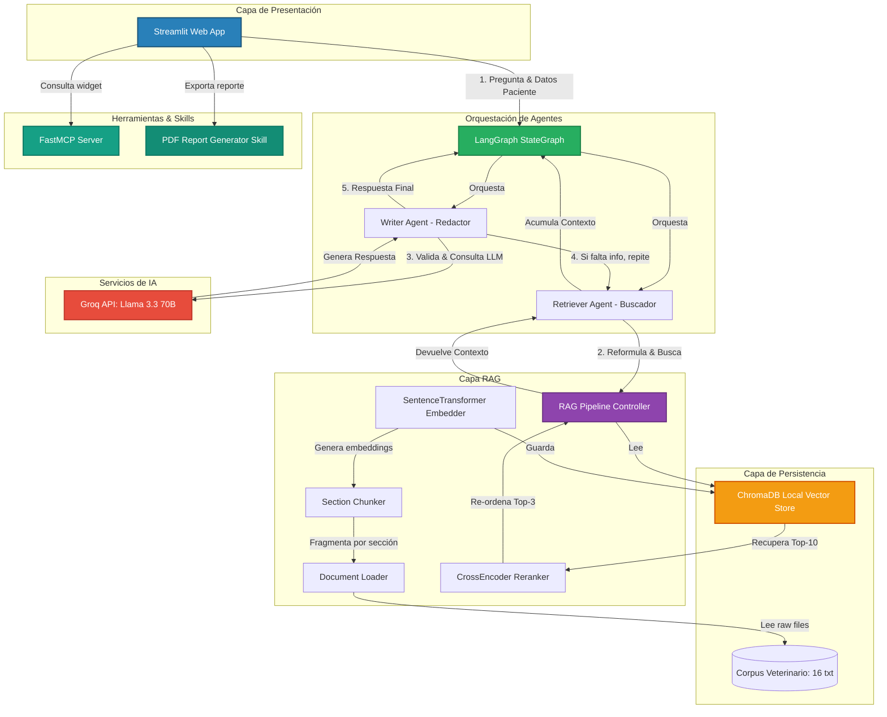

# 🏛️ Arquitectura General — VetAssist AI

Este documento describe la estructura y el flujo de datos global de **VetAssist AI**, un asistente veterinario especializado para clínicas de pequeños animales.

## Diagrama de Arquitectura

El sistema está diseñado bajo una arquitectura desacoplada y modular que combina interfaces de usuario en tiempo real, orquestación de agentes con grafos de estado, bases de datos vectoriales locales e integración de herramientas a través del Model Context Protocol (MCP).

## Componentes Principales

1. **Interfaz Streamlit (`src/app.py`)**: Interfaz gráfica del usuario (GUI) que expone el chat con el asistente, la ficha de registro del paciente (perro/gato, peso, edad), widgets para herramientas clínicas rápidas (dosis y vacunas) y el disparador para exportación a PDF.
2. **Orquestador LangGraph (`src/agents/graph.py`)**: Coordina el ciclo de vida de los agentes mediante un grafo con estados persistentes. Si el agente redactor determina que no hay suficiente información, reenvía el flujo de vuelta al buscador con retroalimentación.
3. **Agente Buscador (`src/agents/retriever_agent.py`)**: Reformula y optimiza la pregunta del usuario utilizando el LLM, realiza la búsqueda y acumula los documentos.
4. **Agente Redactor (`src/agents/writer_agent.py`)**: Valida la relevancia y suficiencia del contexto recuperado. Si es apto, redacta la respuesta, le da el tono clínico apropiado, cita las fuentes de manera estructurada e inserta el disclaimer legal.
5. **Controlador RAG (`src/retrieval/rag_pipeline.py`)**: Expone la lógica de ingesta y recuperación. Integra el cargador, fragmentador semántico, modelo local de embeddings y el re-ranker.
6. **Re-ranker Cross-Encoder (`src/retrieval/reranker.py`)**: Implementa un re-ranking secundario utilizando un modelo pesado entrenado para puntuar la relevancia de pares (pregunta, fragmento) de forma cruzada, reduciendo falsos positivos del espacio vectorial tradicional.
7. **Servidor MCP (`src/mcp/vet_mcp_server.py`)**: Implementa el protocolo estándar Model Context Protocol usando FastMCP. Provee cálculos matemáticos precisos de dosificación y esquemas de vacunación.
8. **Skill Reporte PDF (`src/skills/report_skill.py`)**: Genera de forma asíncrona un archivo PDF con la ficha completa del paciente, anamnesis/conversación e indicaciones sugeridas.
