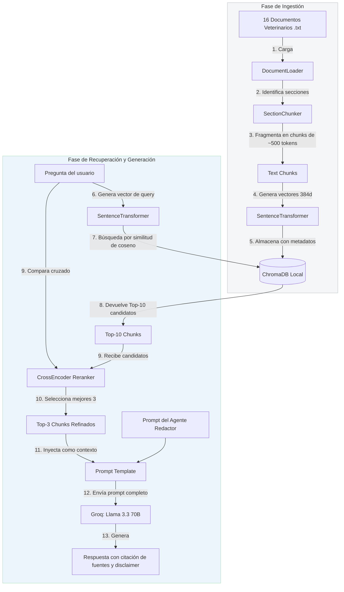

# 🔍 Flujo Detallado de RAG (Retrieval-Augmented Generation)

Este documento detalla el diseño, la metodología de fragmentación y el proceso de recuperación semántica implementado en **VetAssist AI**.

## Diagrama del Flujo RAG

A continuación se ilustra el ciclo de vida de los datos, desde la carga en frío de los documentos de conocimiento veterinario hasta la generación de respuestas contextualizadas en tiempo real:

## Estrategias de Optimización Implementadas

### 1. Ingestion: Fragmentación Semántica por Secciones (`SectionChunker`)
En lugar de fragmentar los archivos de texto basándose únicamente en recuentos de caracteres o tokens fijos (lo cual corta ideas a la mitad y destruye el contexto), desarrollamos un **Chunker por Secciones**:
- **Detección de Títulos**: Examina el texto usando expresiones regulares para identificar títulos principales y subsecciones (por ejemplo, `1. INTRODUCCIÓN`, `TRATAMIENTO`, etc.).
- **Enriquecimiento de Contexto**: A cada fragmento resultante se le antepone dinámicamente un encabezado formateado:
  `[Documento: <nombre_archivo> | Tema: <tema> | Sección: <titulo_sección>]`
  Esto asegura que, incluso si un fragmento contiene información muy específica en medio de la sección, el modelo de embeddings y el LLM sepan con precisión a qué tema y documento pertenece esa información.
- **Ventana Deslizante con Solapamiento (Overlap)**: Si la sección excede el límite de tokens (`CHUNK_SIZE = 500`), se divide en múltiples fragmentos manteniendo un solapamiento del 10% (`CHUNK_OVERLAP = 50`) de tokens para evitar la pérdida de continuidad semántica en los bordes.

### 2. Embeddings: Multilingüe Local y Ligero
Utilizamos el modelo `paraphrase-multilingual-MiniLM-L12-v2` de la suite de `sentence-transformers`:
- **Justificación**: Está entrenado para entender semántica en múltiples idiomas, incluyendo español de manera nativa. Con solo 120MB de peso, se ejecuta localmente a máxima velocidad sin depender de APIs de pago como OpenAI Embeddings.
- **Dimensión**: Genera vectores de 384 dimensiones, un tamaño altamente eficiente que optimiza la búsqueda de ChromaDB y reduce los tiempos de cómputo en CPU/GPU.

### 3. Recuperación: Re-ranking de Dos Etapas con Cross-Encoder
La búsqueda tradicional por similitud de coseno en bases vectoriales a veces sufre de falsos positivos (fragmentos que contienen palabras similares pero no responden directamente a la pregunta). Para solucionar esto, aplicamos un flujo de dos etapas:
1. **Recuperación Vectorial Rápida (Etapa Bi-Encoder)**: Filtramos rápidamente la base de datos completa y seleccionamos los **top-10** fragmentos con mayor similitud semántica.
2. **Re-ranking Profundo (Etapa Cross-Encoder)**: Enviamos los top-10 fragmentos y la pregunta original al modelo `cross-encoder/ms-marco-MiniLM-L-6-v2`. Este modelo evalúa la relación cruzada exacta entre la pregunta y cada fragmento individual, asignándoles un score de relevancia preciso. Seleccionamos únicamente los **top-3** fragmentos refinados para el LLM.
- **Resultado**: Respuestas extremadamente precisas y libres de alucinaciones, inyectando únicamente información de alto valor en la ventana de contexto.
