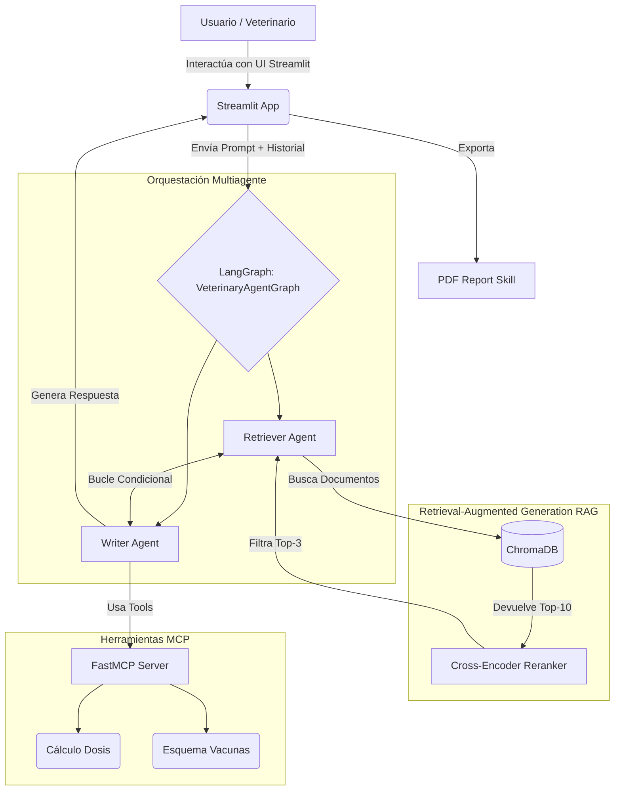

# Informe Técnico: VetAssist AI
**Asistente Inteligente Especializado en Medicina Veterinaria**

**Autor(es):** [Tu Nombre/Equipo]
**Fecha:** [Fecha actual]

## 1. Descripción del Dominio y Casos de Uso

**VetAssist AI** es un sistema inteligente diseñado para asistir a profesionales veterinarios en el diagnóstico rápido, la consulta de protocolos médicos y el cálculo de dosis farmacológicas. El dominio elegido es la **medicina veterinaria** (canina y felina), abarcando áreas críticas como urgencias, enfermedades infecciosas, vacunación, nutrición, cirugía, y farmacología.

### Casos de Uso Principales:
1. **Soporte Clínico en Tiempo Real:** Los veterinarios pueden formular consultas en lenguaje natural (ej. "Manejo inicial de torsión gástrica en perros") y recibir respuestas fundamentadas en literatura especializada.
2. **Cálculo de Dosis Farmacológicas:** Mediante herramientas MCP, el asistente calcula la dosis exacta de medicamentos comunes (Meloxicam, Amoxicilina, etc.) basada en el peso y especie del paciente.
3. **Consulta de Esquemas de Vacunación:** Permite verificar qué vacunas corresponden a una mascota según su edad en semanas.
4. **Generación de Reportes Clínicos:** Exportación del historial de la consulta y las recomendaciones a un formato PDF para adjuntarlo al expediente del paciente.

## 2. Arquitectura del Sistema

El sistema utiliza una arquitectura modular basada en LangGraph para la orquestación, ChromaDB para la base vectorial, y Streamlit para la interfaz de usuario. 

## 3. Pipeline RAG y Base de Datos Vectorial

El sistema implementa un pipeline RAG (Retrieval-Augmented Generation) avanzado para garantizar precisión clínica y evitar alucinaciones.

### Estrategia de Chunking
Se diseñó un **Chunking Semántico basado en Secciones**. Los documentos veterinarios tienen estructuras predecibles (títulos, subtítulos). El `SectionChunker` divide los textos respetando estas secciones lógicas, con un tamaño máximo aproximado de 500 palabras y un solapamiento (overlap) de 50 palabras para mantener el contexto entre fragmentos consecutivos.

### Base de Datos Vectorial y Embeddings
- **ChromaDB** actúa como la base de datos vectorial local.
- Se utiliza el modelo **`paraphrase-multilingual-MiniLM-L12-v2`** (a través de `sentence-transformers`) para generar los embeddings. Este modelo es ligero, funciona localmente sin costo y tiene excelente rendimiento en español.

### Estrategia de Búsqueda y Re-ranking
1. **Recuperación Inicial:** ChromaDB recupera los 10 fragmentos (`Top-K=10`) más cercanos usando similitud del coseno.
2. **Re-ranking (Cross-Encoder):** Se emplea el modelo **`ms-marco-MiniLM-L-6-v2`** para evaluar la relevancia semántica exacta entre la query del usuario y cada uno de los 10 fragmentos recuperados. Solo los 3 mejores fragmentos (`Top-K=3`) se envían al LLM, reduciendo el ruido y mejorando la calidad de la respuesta.

## 4. Interacción Multiagente

Se implementó un grafo de estados (`StateGraph`) usando **LangGraph**, definiendo un estado compartido (`VetAssistState`) que mantiene el historial de mensajes, el contexto recuperado, los pasos realizados y una bandera de información faltante (`missing_info`).

### Roles de los Agentes:
1. **Retriever Agent:** Especializado en búsqueda. Analiza la consulta del usuario, la reformula si es necesario y extrae información de ChromaDB.
2. **Writer Agent:** Asume el rol clínico. Revisa si el contexto recuperado por el Retriever es suficiente. Si falta información, activa la bandera `missing_info` para que el grafo vuelva al Retriever (bucle de retroalimentación, con un máximo de 2 iteraciones). Además, el Writer tiene acceso al servidor MCP para ejecutar cálculos matemáticos precisos (dosis) o buscar esquemas rígidos (vacunas).

## 5. Decisiones Técnicas

### Modelo de Lenguaje (LLM)
Se eligió **Groq (Llama-3.3-70b-versatile)** a través de su API gratuita. 
- *Justificación:* Llama 3 ofrece capacidades excepcionales de razonamiento lógico, esenciales para un entorno clínico. Groq fue seleccionado por su latencia ultrabaja (LPUs), lo cual permite una interacción fluida y en tiempo real con el veterinario, vital en casos de urgencia.

### Protocolo MCP (Model Context Protocol)
- *Justificación:* El cálculo de dosis (ej. mg/kg) es crítico; un error del LLM puede ser fatal. Al usar `FastMCP`, externalizamos el cálculo matemático a código Python puro (determinista y seguro), previniendo alucinaciones matemáticas del LLM.

### Re-ranking (Cross-Encoder)
- *Justificación:* Los embeddings a menudo sufren del problema de "similitud léxica sin relevancia". El re-ranking añade un paso de clasificación supervisada cruzada que eleva drásticamente la pertinencia del contexto enviado al LLM, crucial en dominios médicos donde los detalles finos importan.

## 6. Conclusiones y Posibles Mejoras

**Conclusiones:**
VetAssist AI demuestra cómo la integración de RAG avanzado (con re-ranking), orquestación multiagente y herramientas deterministas (MCP) puede crear un asistente confiable y útil en un entorno profesional crítico. El sistema cumple estrictamente con el requisito de basar sus respuestas únicamente en el corpus proporcionado, citando sus fuentes de manera transparente.

**Posibles Mejoras Futuras:**
1. **Soporte Multimodal:** Integrar modelos de visión para analizar radiografías o fotografías de lesiones dermatológicas.
2. **Integración con Software de Gestión:** Conectar el sistema directamente a bases de datos de clínicas veterinarias (EHR) a través de APIs, para auto-completar el historial del paciente.
3. **Agentes de Triaje Automático:** Un agente especializado en evaluar rápidamente la gravedad de los síntomas ingresados por el tutor antes de llegar a la clínica.
