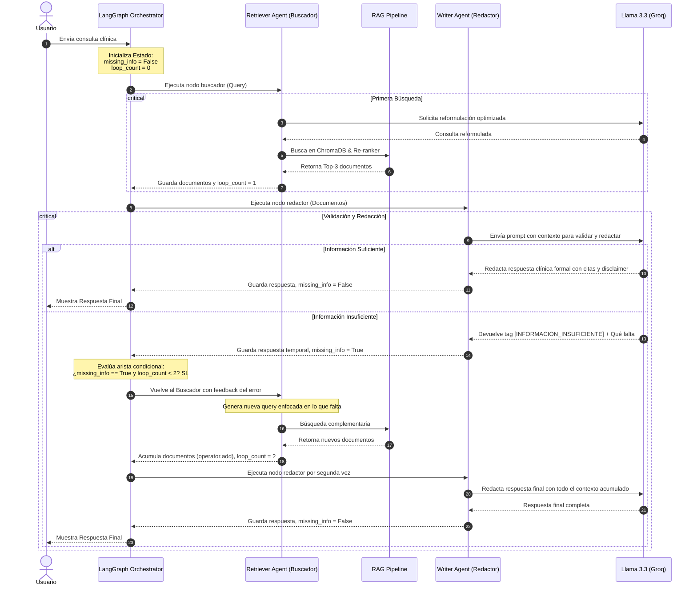

# 🤝 Interacción y Coordinación de Agentes (LangGraph)

Este documento detalla el diseño del flujo multiagente implementado con **LangGraph** en **VetAssist AI**, especificando los roles de los agentes, su estado y el mecanismo de retroalimentación en bucle.

## Diagrama de Secuencia de Agentes

El siguiente diagrama detalla cómo interactúan el **Retriever Agent** y el **Writer Agent** para garantizar que la respuesta final esté respaldada por la base de conocimientos:

## Roles y Responsabilidades

### 1. Retriever Agent (Buscador)
- **Objetivo**: Garantizar que se localice la mayor cantidad de información útil relevante a la consulta.
- **Lógica**:
  - En la primera iteración, reformula la consulta en lenguaje natural a un formato optimizado para la indexación semántica (eliminando ruido conversacional).
  - Si es invocado por segunda vez (tras un feedback de información insuficiente del redactor), utiliza el LLM para identificar específicamente qué datos faltan y realiza una búsqueda dirigida (ej. buscar contraindicaciones específicas de un fármaco si antes solo se buscó la dosis).

### 2. Writer Agent (Redactor)
- **Objetivo**: Evaluar críticamente el contexto recuperado, estructurar la información clínicamente y redactar la respuesta con el tono adecuado.
- **Lógica**:
  - Actúa como un **validador de calidad (Guardrail)**. Si el buscador recupera información irrelevante, el redactor lo detecta e instruye un retorno inmediato al buscador, definiendo qué información falta.
  - Asegura que todas las afirmaciones estén vinculadas a una fuente válida mediante el tag `[Fuente: archivo_origen]`.
  - Fuerza la inclusión del disclaimer legal para prevenir malas prácticas o automedicación de mascotas.

## Diseño del Estado Compartido (`VetAssistState`)

El flujo de información es gestionado a través de un diccionario de estado tipado (`TypedDict`) con las siguientes propiedades:

- `query` (str): La pregunta original del usuario.
- `retrieved_docs` (List[dict]): Una lista acumulativa de documentos recuperados de ChromaDB. LangGraph utiliza `Annotated[..., operator.add]` en este campo, lo que significa que en la segunda iteración, los nuevos documentos se agregan a los existentes automáticamente sin sobrescribirlos.
- `answer` (str): La respuesta textual generada.
- `sources` (List[str]): Las fuentes únicas consolidadas en el reporte.
- `loop_count` (int): Contador incremental para limitar la recursión de agentes a máximo 2 ciclos (evitando sobrecostos de llamadas API y latencia).
- `missing_info` (bool): Flag de control para el enrutador condicional.
